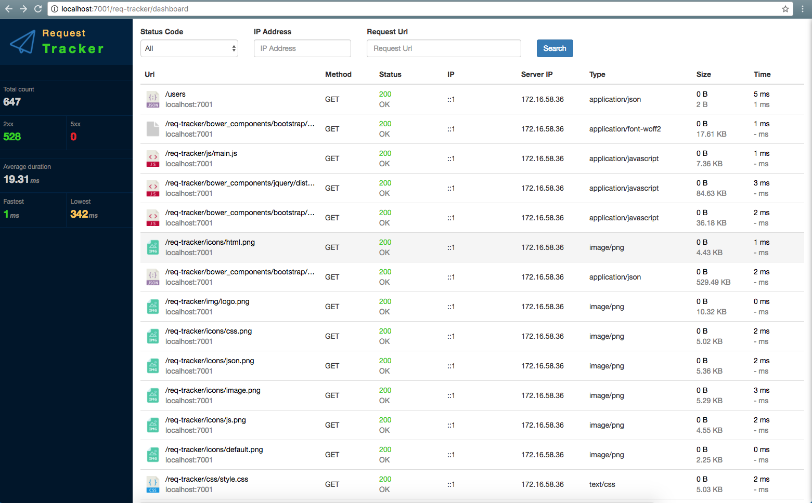

# express-req-tracker

A Express middleware for tracking request and responses.

## Installation

```bash
yarn add express-req-tracker
# or
npm install -S express-req-tracker
```

## Run Example

```bash
# compile
npm run compile

# run
npm run start
```

## Usage

```js
import express from 'express';
import reqTracker from '../src';

const app = express();

// use req-tracker
app.use(reqTracker({
  app: 'my-project',
  mongodb: 'mongodb://path of your database server',
  options: {
    immediate: false
  }
}));

app.get('/', (req, res) => {
  res.json('hello world');
});

const PORT = process.env.PORT;
app.listen(PORT, () => {
  console.log(`server is running at: http://localhost:${PORT}`);
});
```

## Dashboard

You also can open the dashboard: [http://{your server host}/req-tracker/dashboard](http://localhost:7001/req-tracker/dashboard) to view the request logs.



## License

MIT